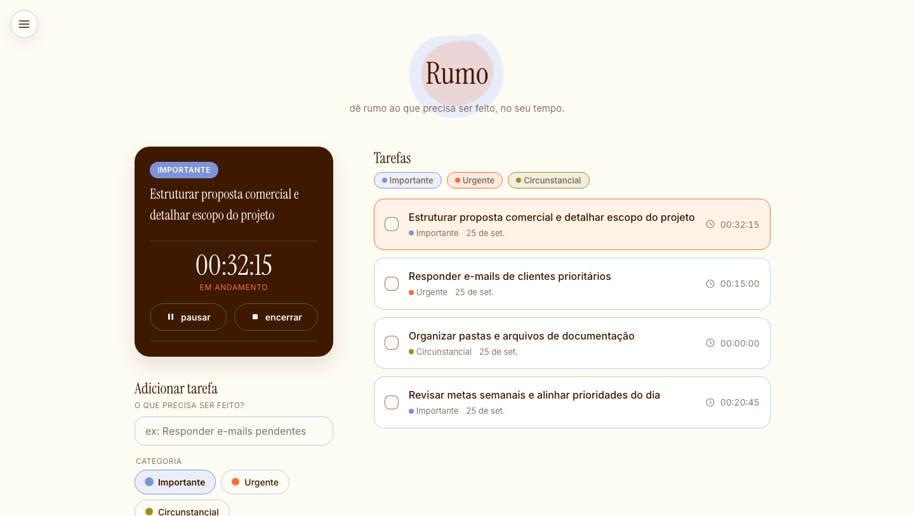

<div align="center">

# Rumo

### *Dê rumo ao que precisa ser feito, no seu tempo.*

Uma aplicação web desenvolvida para transformar a forma como você organiza e executa suas tarefas, substituindo listas soltas e confusas por um fluxo estruturado, focado e funcional.

[](https://react.dev/)
[](https://vitejs.dev/)
[](https://developer.mozilla.org/pt-BR/docs/Web/JavaScript)
[](https://developer.mozilla.org/pt-BR/docs/Web/CSS)
[](LICENSE)

<br />



</div>

---

## Sumário

- [Sobre o Projeto](#sobre-o-projeto)
- [Funcionalidades Principais](#funcionalidades-principais)
- [Roadmap (Próximos Passos)](#roadmap-próximos-passos)
- [Como Rodar o Projeto Localmente](#como-rodar-o-projeto-localmente)

---

## Sobre o Projeto

Muitas ferramentas de produtividade tradicionais acabam virando depósitos infinitos de pendências: listas desordenadas que geram sobrecarga mental, paralisia por análise e a constante sensação de estar correndo sem sair do lugar.

O **Rumo** nasceu a partir da necessidade real de **sair do planejamento e realmente executar**. Em vez de incentivar uma lista interminável de afazeres, a aplicação promove a definição de prioridades claras, escolha da tarefa que merece sua atenção agora e acompanha o tempo investido em cada entrega.

O **Rumo** é perfeito para quem quer:

- **Tirar tarefas da cabeça** e estruturar o dia com clareza imediata.
- **Parar de se perder em listas infinitas** e backlog desordenado.
- **Priorizar com critério**, sabendo exatamente o que vem primeiro.
- **Transformar demandas grandes em passos menores e executáveis**.
- **Superar a paralisia do planejamento** e entrar em ação.
- **Trabalhar de forma mais consciente**, respeitando o próprio ritmo.

---

## Funcionalidades Principais

- **Foco na Tarefa Ativa & Timer de Execução**:  
  Destaque visual exclusivo para a tarefa em andamento no topo da tela, acompanhado de um cronômetro para medir o tempo real dedicado. Isso permite identificar gargalos, reconhecer padrões de produtividade e estimar melhor compromissos futuros.

- **Categorização Inspirada na Metodologia da Tríade do Tempo**:  
  Organização visual de demandas em três pilares fundamentais:
  - **Importante**: Atividades com prazo espontâneo que trazem resultados consistentes.
  - **Urgente**: Demandas de última hora que geram estresse e pressão.
  - **Circunstancial**: Tarefas secundárias ou rotineiras que podem ser remanejadas.

- **Painel Lateral de Customização de Categorias**:  
  Liberdade total para renomear as categorias e escolher paletas de cores personalizadas através de seletores de cor nativos, sincronizados dinamicamente via variáveis CSS.

- **Filtros Rápidos Multi-seleção**:  
  Chips interativos de filtro que permitem visualizar apenas as tarefas das categorias desejadas, limpando o ruído visual quando o foco precisa ser restrito.

- **Edição Fluida em Linha (Inline Editing)**:  
  Edite a descrição de qualquer tarefa diretamente na lista, com suporte a atalhos intuitivos de teclado

- **Persistência Local Automática (Zero Fricção)**:  
  Tudo é gravado em tempo real no `localStorage` do navegador.

---

## Roadmap (Próximos Passos)

- [ ] **Desdobramento de Tarefas (Checklist / Sub-passos)**: Capacidade de abrir uma tarefa e dividi-la em pequenas etapas sequenciais.
- [ ] **Painel de Métricas e Produtividade**: Relatórios visuais com gráficos da proporção de tempo gasto entre tarefas Importantes, Urgentes e Circunstanciais.
- [ ] **Integração Completa do Timer**: Temporizador regressivo (Pomodoro) e contagem progressiva em tempo real.
- [ ] **PWA (Progressive Web App)**: Permitir instalação da aplicação no desktop e celular para uso 100% offline.
- [ ] **Exportação e Backup**: Possibilidade de exportar e importar dados em formato JSON ou CSV.

---

## Como Rodar o Projeto Localmente


1. **Clone o repositório:**
   ```bash
   git clone https://github.com/saraaniceto/rumo.git
   ```

2. **Acesse a pasta do projeto:**
   ```bash
   cd rumo
   ```

3. **Instale as dependências:**
   ```bash
   npm install
   ```

4. **Inicie o servidor de desenvolvimento:**
   ```bash
   npm run dev
   ```


### Scripts Disponíveis

- `npm run dev`: Executa a aplicação em modo de desenvolvimento com hot-reload.
- `npm run build`: Gera o bundle otimizado de produção na pasta `dist/`.
- `npm run preview`: Visualiza localmente o build de produção.
- `npm run lint`: Executa a verificação estática de código com o ESLint.
